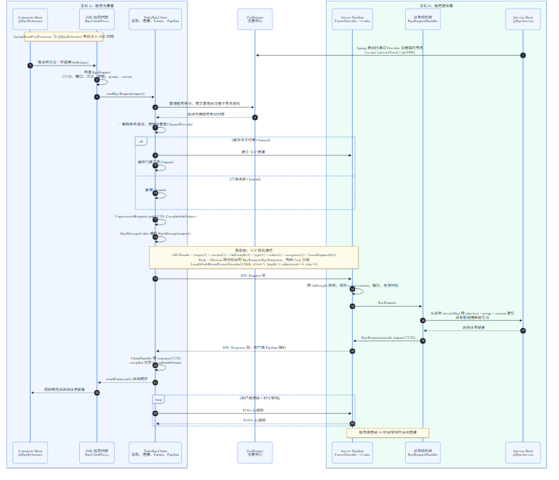

# RPC-frame-work

<!-- markdownlint-disable MD013 -->

一个基于 Java、Netty、ZooKeeper 和 Spring 实现的轻量级 RPC 学习框架。项目围绕一次远程调用的完整链路展开：服务注册与发现、客户端代理、连接复用、自定义协议、序列化与压缩、服务端反射调用，以及请求与响应关联。

> 项目参考 JavaGuide RPC 框架的设计思路，并在 ZooKeeper 会话重连、Channel/Future 管理、编解码、负载均衡和 Spring 注解接入等方向进行了学习实现与扩展。当前定位是理解 RPC 核心机制，不等同于生产级框架。

## 核心能力

- 自定义 16 字节协议头，使用 `LengthFieldBasedFrameDecoder` 处理 TCP 粘包和半包。
- Netty NIO 通信，客户端缓存并复用 Channel，服务端将业务处理从 IO EventLoop 中隔离。
- 使用 `CompletableFuture` 和请求体 UUID 关联并发请求与响应。
- 基于 ZooKeeper/Curator 完成服务注册、发现、本地地址缓存、节点监听和会话恢复后的重新注册。
- 自定义 SPI 扩展序列化、压缩、注册发现、传输和负载均衡实现。
- 支持 Hessian、Kryo、Protostuff 序列化实现和 Gzip 压缩；当前示例链路默认使用 Hessian + Gzip。
- 提供随机、轮询、最少活跃和一致性哈希实现；当前服务发现默认使用一致性哈希。
- 通过 `@RpcScan`、`@RpcService`、`@RpcReference` 完成服务发布和客户端代理注入。

## 模块结构

| 模块 | 职责 |
| --- | --- |
| `hello-service-api` | 客户端与服务端共享的接口和 DTO |
| `rpc-framework-common` | 枚举、异常、SPI 加载器、单例工厂、线程池与通用工具 |
| `rpc-framework-simple` | 协议、编解码、Netty/Socket 传输、注册发现、负载均衡、序列化压缩和 Spring 接入 |
| `example-server` | Provider 示例，发布 `HelloService` 并启动 Netty 服务端 |
| `example-client` | Consumer 示例，通过 `@RpcReference` 发起远程调用 |

## 两台主机之间的一次 RPC 调用

下图将控制面与数据面放在一起：ZooKeeper 负责注册与发现，主机 A 和主机 B 之间通过 Netty/TCP 传输 RPC 请求、响应和心跳。



[查看 Mermaid 源文件](figures/two-host-rpc-flow.mmd)

完整链路可以压缩成以下十步：

1. 服务端 Spring 容器扫描 `@RpcService`，将实现对象写入本地 `serviceMap`，并向 ZooKeeper 注册临时节点。
2. 客户端 Spring 容器为 `@RpcReference` 字段注入 JDK 动态代理。
3. 业务方法调用进入 `RpcClientProxy`，代理构造包含 UUID、接口、方法、参数、group 和 version 的 `RpcRequest`。
4. `ZkServiceDiscoveryImpl` 从本地缓存或 ZooKeeper 读取地址列表，并用一致性哈希选择节点。
5. `NettyRpcClient` 从 `ChannelProvider` 复用活动连接；缓存未命中时才建立 TCP Channel。
6. 客户端先保存 `UUID -> CompletableFuture`，再将请求封装为 `RpcMessage`。
7. `RpcMessageCodec` 对请求进行 Hessian 序列化和 Gzip 压缩，写入协议头后由 Netty 发送。
8. 服务端拆帧、校验、解压和反序列化，在独立业务线程组中查找本地服务并反射调用目标方法。
9. 服务端把原请求 UUID 写入 `RpcResponse`，经过相同协议链路返回客户端。
10. 客户端根据响应 UUID 完成对应 Future，唤醒等待线程，代理校验响应后把业务结果返回给调用方。

## 自定义协议

协议头固定为 16 字节，消息体长度为 `fullLength - 16`。

| 字节偏移 | 长度 | 字段 | 作用 |
| --- | ---: | --- | --- |
| `0-3` | 4 B | `magic` | 固定为 `grpc`，快速拒绝非法协议 |
| `4` | 1 B | `version` | 当前协议版本为 `1` |
| `5-8` | 4 B | `fullLength` | 整个帧的长度，包含协议头和消息体 |
| `9` | 1 B | `messageType` | 请求、响应、PING 或 PONG |
| `10` | 1 B | `codec` | 序列化算法编号 |
| `11` | 1 B | `compress` | 压缩算法编号 |
| `12-15` | 4 B | `frameRequestId` | 当前实现中的帧序号 |
| `16...` | 可变 | `body` | 压缩后的 `RpcRequest` 或 `RpcResponse` |

帧解码参数为：

```text
maxFrameLength    = 8 MiB
lengthFieldOffset = 5
lengthFieldLength = 4
lengthAdjustment  = -9
initialBytesStrip = 0
```

`fullLength` 从整帧起点计算，而 Netty 在读取完长度字段时已经越过前 9 个字节，因此 `lengthAdjustment = -9`。

> 当前真正用于 `CompletableFuture` 关联的是请求体中的字符串 UUID。协议头的整型 `frameRequestId` 尚未回显参与关联，后续可将两套 ID 统一。

## Netty 线程与连接模型

- 客户端使用 `NioEventLoopGroup` 处理连接、编解码和响应事件。
- 服务端使用 1 个 boss 线程接受连接，worker EventLoop 处理网络读写。
- `NettyRpcServerHandler` 被放入 `DefaultEventExecutorGroup(cpus * 2)`，反射调用和业务代码不会阻塞 worker EventLoop。
- `ChannelProvider` 按服务地址缓存活动 Channel；失效 Channel 会在下一次获取时剔除并重新连接。
- 客户端连续 5 秒写空闲时发送 PING，服务端回复 PONG；服务端连续 30 秒读空闲时关闭连接。

## 服务注册与发现

服务键由 `interfaceName + group + version` 组成，ZooKeeper 节点结构如下：

```text
/my-rpc
└── github.javaguide.HelloServicetest1version1
    └── 192.168.x.x:9998          # EPHEMERAL
```

- Provider 使用临时节点注册实例，并在 JVM ShutdownHook 中主动清理节点和线程池。
- Consumer 首次发现服务时读取子节点并缓存地址列表，同时注册 `PathChildrenCache`。
- 节点发生变化时，当前实现重新拉取全部子节点并替换本地缓存。
- ZooKeeper session 丢失后记录重注册状态，重新连接成功时恢复临时节点。

## 运行入口

环境要求：JDK 8、Maven 3.6+、ZooKeeper（默认 `127.0.0.1:2181`）。

启动顺序：

1. 启动 ZooKeeper。
2. 运行 `example-server/src/main/java/NettyServerMain.java`，监听 `9998`。
3. 运行 `example-client/src/main/java/github/javaguide/NettyClientMain.java`。
4. 客户端第一次调用后会等待 12 秒，以便观察写空闲触发的心跳，随后再调用 10 次。

## 核心源码导航

| 主题 | 入口 |
| --- | --- |
| Spring 注解扫描与代理注入 | [`CustomScannerRegistrar`](rpc-framework-simple/src/main/java/github/javaguide/spring/CustomScannerRegistrar.java)、[`SpringBeanPostProcessor`](rpc-framework-simple/src/main/java/github/javaguide/spring/SpringBeanPostProcessor.java) |
| 客户端动态代理 | [`RpcClientProxy`](rpc-framework-simple/src/main/java/github/javaguide/proxy/RpcClientProxy.java) |
| 服务发现与负载均衡 | [`ZkServiceDiscoveryImpl`](rpc-framework-simple/src/main/java/github/javaguide/registry/zk/ZkServiceDiscoveryImpl.java) |
| Netty 客户端与连接复用 | [`NettyRpcClient`](rpc-framework-simple/src/main/java/github/javaguide/remoting/transport/netty/client/NettyRpcClient.java)、[`ChannelProvider`](rpc-framework-simple/src/main/java/github/javaguide/remoting/transport/netty/client/ChannelProvider.java) |
| 请求响应关联 | [`UnprocessedRequests`](rpc-framework-simple/src/main/java/github/javaguide/remoting/transport/netty/client/UnprocessedRequests.java) |
| 协议编解码 | [`RpcMessageFrameDecoder`](rpc-framework-simple/src/main/java/github/javaguide/remoting/transport/netty/codec/RpcMessageFrameDecoder.java)、[`RpcMessageCodec`](rpc-framework-simple/src/main/java/github/javaguide/remoting/transport/netty/codec/RpcMessageCodec.java) |
| Netty 服务端 | [`NettyRpcServer`](rpc-framework-simple/src/main/java/github/javaguide/remoting/transport/netty/server/NettyRpcServer.java)、[`NettyRpcServerHandler`](rpc-framework-simple/src/main/java/github/javaguide/remoting/transport/netty/server/NettyRpcServerHandler.java) |
| 服务注册与本地服务表 | [`ZkServiceProviderImpl`](rpc-framework-simple/src/main/java/github/javaguide/provider/impl/ZkServiceProviderImpl.java)、[`CuratorUtils`](rpc-framework-simple/src/main/java/github/javaguide/registry/zk/util/CuratorUtils.java) |
| SPI 扩展加载 | [`ExtensionLoader`](rpc-framework-common/src/main/java/github/javaguide/extension/ExtensionLoader.java) |

## 当前实现边界

- 网络收发与响应回填是异步的，但业务接口最终调用 `resultFuture.get()`，对调用者表现为同步阻塞。
- 尚未实现 RPC 调用超时、自动重试、幂等保护、熔断、限流、鉴权和链路追踪。
- Channel 首次创建不是原子操作，并发冷启动时可能重复建连。
- 服务发现当前硬编码使用一致性哈希，尚未通过外部配置动态切换策略。
- 注册中心监听是“事件触发后全量刷新”，不是逐条增量更新。
- 当前实现适合学习与面试讲解，生产化仍需补齐容错、治理、安全和可观测性能力。
